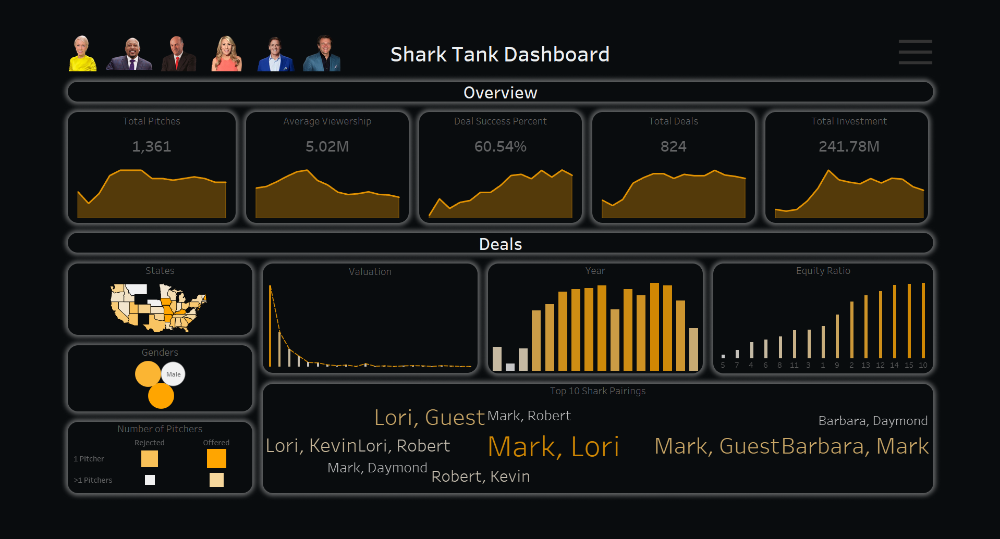
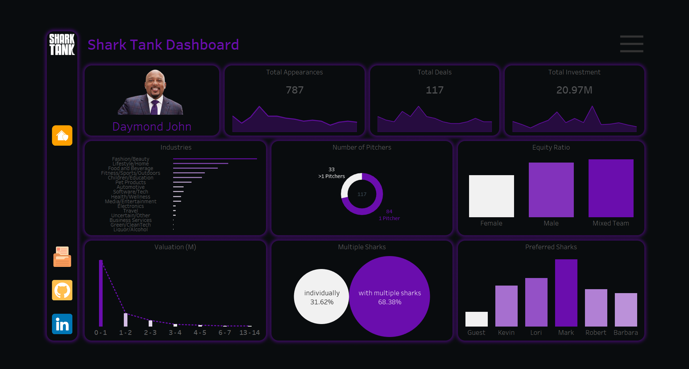
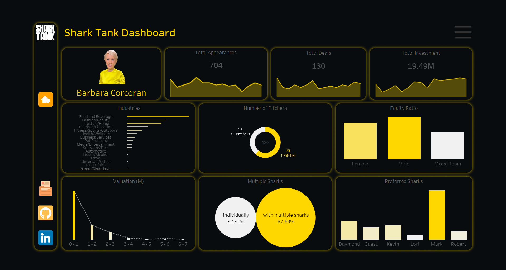
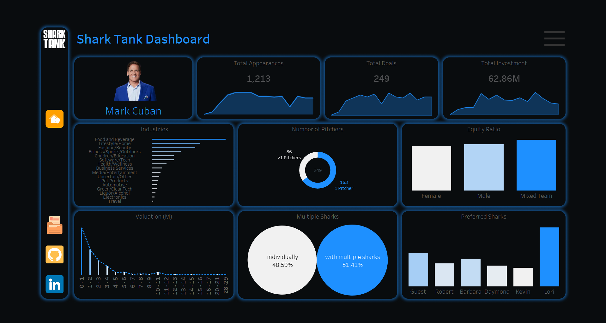
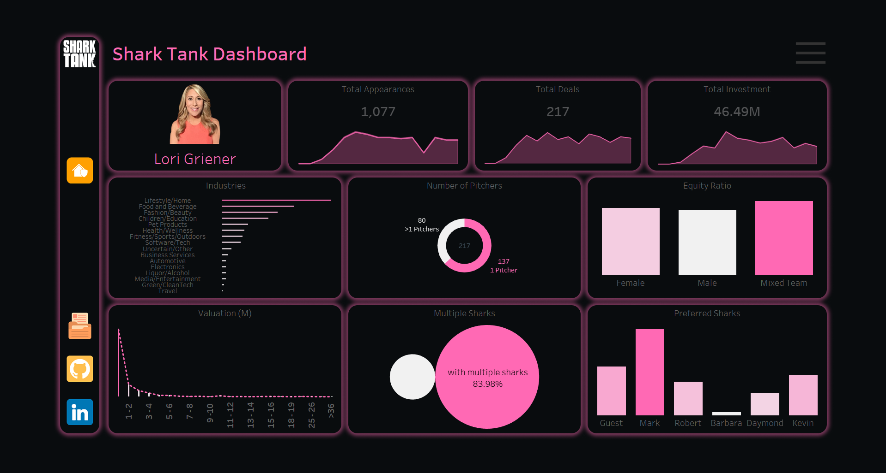

# 🦈 Shark Tank Investment Analysis Dashboard

> **Analyze and visualize the investment patterns of Shark Tank investors using insightful dashboards and data-driven insights, leveraging Python, Tableau, Figma, and web scraping tools.**

---

## 📊 Project Overview

This project provides an in-depth analysis of Shark Tank investment trends, helping entrepreneurs understand each shark's investment preferences and prepare for their pitches. The data has been gathered from various sources, including web scraping and Kaggle, followed by data preprocessing, manipulation, and modeling. The dashboard is designed using Tableau and styled with Figma for a clean and professional look.

### 🔍 Insights Provided
- **Shark-specific investment patterns:** Understand each shark’s industry preferences, deal structure, valuation trends, and more.
- **Pitch success factors:** Insights on factors contributing to successful deals, such as industry trends, valuation ranges, and team composition.
- **Collaborative investments:** Analysis of sharks' co-investment trends, highlighting the most frequent shark partnerships.

---

## 🚀 Features

- **📈 Interactive Dashboards:** Drill-down capabilities, filters, and navigations for deep data exploration.
- **🖌️ Professional Design:** Styled with Figma to ensure a clean, visually appealing user experience.
- **🔧 Custom Data Manipulation:** Python was used to preprocess the data, handle outliers, and perform data modeling for accurate analysis.
- **🌍 Geographic Insights:** Heatmaps and charts showing regional investment trends.

---

## 🔧 Tech Stack

- **Languages & Tools:**
  
  - 
  - 
  - 
  - 
  - 

---

## 🏗️ Project Workflow

1. **Data Collection:**
   - Data was web scraped from the internet and gathered from Kaggle.
2. **Data Preprocessing:**
   - Outlier removal, data cleaning, and manipulation were done using Python (Pandas, NumPy).
3. **Data Modeling:**
   - Insights were derived by modeling the data and performing statistical analysis.
4. **Dashboard Design:**
   - The dashboard was designed in Figma to create a user-friendly and professional layout.
5. **Dashboard Development:**
   - Interactive visualizations were built using Tableau, featuring filters, drill-downs, and navigation for a comprehensive analysis.

---

## 🌍 Overall Investment Insights

> **Comprehensive Analysis of Shark Tank Investments**  
> This dashboard provides an aggregated view of all sharks' investments across multiple seasons, helping identify key trends, popular sectors, and successful investment strategies.

### 🏆 Key Insights:
- **Total Investments:** Over **$186M** across **840+ deals**, reflecting a robust commitment to innovation and entrepreneurship.
- **Top Sectors:** The most popular sectors include **Food and Beverage**, **Fashion/Beauty**, and **Tech/Software**, accounting for over **60% of all deals**.
- **High Success Rates in Early Stages:** Investments in startups valued below **$5M** showed the highest success rates, with a notable preference for companies in growth stages.
- **Collaborative Investments:** Approximately **70% of deals** involve co-investments between multiple sharks, highlighting the collaborative nature of decision-making.

---

## 📸 Dashboard Previews

### Daymond John's Dashboard

> **Key Insights:**
> - Total Investments: $20.97M across 117 deals
> - Top Sectors: Fashion/Beauty, Lifestyle/Home, Food and Beverage
> - High preference for early-stage startups ($0-1M valuation)

### Barbara Corcoran's Dashboard

> **Key Insights:**
> - Total Investments: $19.49M across 130 deals
> - Top Sectors: Food and Beverage, Fashion/Beauty
> - Active in deals with multiple sharks (67.69%)

### Mark Cuban's Dashboard

> **Key Insights:**
> - Total Investments: $62.86M across 249 deals
> - Focus on tech-driven, scalable ideas
> - Most frequent co-investor: Lori Greiner

### Lori Greiner's Dashboard

> **Key Insights:**
> - Total Investments: $46.49M across 217 deals
> - Strong interest in Lifestyle/Home and Fashion/Beauty sectors
> - Frequently collaborates with other sharks (83.98%)

### Robert Herjavec's Dashboard

> **Key Insights:**
> - Total Investments: $36.33M across 127 deals
> - Major sectors: Fitness/Sports, Food and Beverage
> - Collaborative investment approach (59.84% deals with other sharks)

---

## 📫 Connect with Me

Feel free to reach out and connect! You can find me on the following platforms:

| Platform         
|------------------------|
| [**LinkedIn**](https://www.linkedin.com/in/animeshgarg153) |
| [**Portfolio Website**](https://animeshgarg.framer.ai) |
| [**Tableau Profile**](https://public.tableau.com/app/profile/animesh.garg/vizzes) |

---

